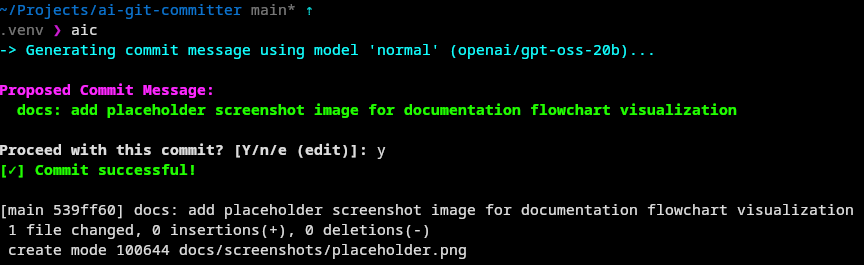

# ai-git-committer

`ai-git-committer` (`aic`) is a terminal application that analyzes staged Git changes and uses Groq-hosted models to propose a one-line [Conventional Commit](https://www.conventionalcommits.org/) message.

The generated message is validated before being presented for interactive confirmation. The application creates a commit only after you confirm it.

Groq API keys are encrypted locally using Fernet rather than stored in plaintext. Configuration and commit-message history are stored under `~/.config/ai-git-committer/`.

## Screenshot



## Requirements

Before installing, make sure the following dependencies are available:

* **[fish](https://fishshell.com/)** — required shell. Bash support is planned for a future release.
* **[Python 3.11+](https://www.python.org/)** — required to run the application.
* **[Git](https://git-scm.com/)** — required for Git repository operations.
* **[Groq API key](https://console.groq.com/)** — required to use the AI features.

### Arch Linux packaging dependencies

* [`python`](https://archlinux.org/packages/core/x86_64/python/)
* [`python-cryptography`](https://archlinux.org/packages/extra/x86_64/python-cryptography/)
* [`python-groq`](https://archlinux.org/packages/extra/any/python-groq/)
* [`git`](https://archlinux.org/packages/extra/x86_64/git/)
* [`python-build`](https://archlinux.org/packages/extra/any/python-build/)
* [`python-installer`](https://archlinux.org/packages/extra/any/python-installer/)
* [`python-wheel`](https://archlinux.org/packages/extra/any/python-wheel/)

## Install on Arch Linux

Clone the repository using either **SSH** or **HTTPS**.

### SSH

```fish
git clone git@github.com:gnxbd4vbtm-ops/ai-git-committer.git
```

### HTTPS

```fish
git clone https://github.com/gnxbd4vbtm-ops/ai-git-committer.git
```

Then build and install the package:

```fish
cd ai-git-committer/packaging
makepkg -Ccfsi
```

The `makepkg` command:

* `-C` cleans previous build artifacts.
* `-c` removes build dependencies and other temporary files after the build.
* `-f` forces a rebuild.
* `-s` installs missing dependencies.
* `-i` installs the resulting package.

### Installed files

The package installs:

* `/usr/bin/aic`
* `/usr/bin/ai-git-committer`
* `/usr/share/applications/ai-git-committer.desktop`
* `/usr/share/icons/hicolor/512x512/apps/ai-git-committer.png`

The Arch `PKGBUILD` is located in `packaging/` and builds from the reproducible `v0.1.8` Git source tag.

Run `makepkg` from the `packaging/` directory. Its generated `src/` and `pkg/` directories remain separate from the tracked application source in the repository root.

The `PKGBUILD` uses the system Python environment so that an activated virtual environment cannot shadow Arch Linux's `python-build` and `python-installer` packages.

## Configure Groq

Store your Groq API key with either installed command:

```fish
aic --api-key <your_key_here>
```

The CLI encrypts the API key before storing it locally.

To display the current configuration, paths, and active settings:

```fish
aic --config
```

## Usage

Run `aic` from inside a Git working tree:

```fish
aic
```

By default, automatic staging is enabled (`git add .`). **Review your working tree before running `aic`** if you do not want every change staged.

The application:

1. Stages changes when automatic staging is enabled.
2. Analyzes the staged file names, statuses, and diff.
3. Generates a Conventional Commit message.
4. Validates the generated message.
5. Prompts you for confirmation.
6. Creates the commit only if you confirm it.

Declining the confirmation prompt leaves the repository uncommitted.

### Command-line options

```text
--api-key KEY       Encrypt and store a Groq API key
--model MODEL       Use a model for this run
--set-model MODEL   Save the default model or explicit model ID
--list              Show configured model presets
--history           Show generated-message history
--history-clear     Clear generated-message history
--config            Show configuration and paths
--edit-config       Open config.json in $EDITOR
--reset-config      Restore default configuration
--restore           Restore default configuration (if config.json is corrupted)
--debug             Enable debug logging
--uninstall         Remove user configuration (~/.config/ai-git-committer/)
```

Run:

```fish
aic --help
```

for the authoritative and up-to-date option list.

## Uninstallation

To remove your user configuration (`~/.config/ai-git-committer/`):

```fish
aic --uninstall
```

Then remove the system package:

```fish
sudo pacman -R ai-git-committer
```
## Shell Completions

Fish shell completions are included with the Arch Linux package and installed automatically to:

```text
/usr/share/fish/vendor_completions.d/aic.fish
```

Completions are available for both `aic` and `ai-git-committer`, including command-line options and supported model presets.

For example:

```fish
aic --<TAB>
aic --model <TAB>
aic --set-model <TAB>
```

Available model suggestions include:

* `normal` → `openai/gpt-oss-20b`
* `smart` → `openai/gpt-oss-120b`
* `gpt-oss-20b` → `openai/gpt-oss-20b`
* `gpt-oss-120b` → `openai/gpt-oss-120b`
* `qwen3-32b` → `qwen/qwen3-32b`
* `qwen3-72b` → `qwen/qwen3-72b`
* `kimi-k2-instruct` → `moonshotai/kimi-k2-instruct`

Custom Groq model IDs can still be entered manually. The completion list provides suggestions but does not restrict the model argument to the listed presets.


## Desktop Entry

The package adds **AI Git Committer** to the desktop application menu.

Launching the entry opens `aic --help` in a terminal and waits for Enter before closing, keeping the usage information visible.

## Development Cleanup — `fish` Only

Use the cleanup script to reset the local Arch Linux package installation and rebuild it from scratch:

```fish
fish ./clean.fish
```

The script:

1. Asks for confirmation before making changes.
2. Removes the installed `ai-git-committer` package.
3. Removes known generated package and build artifacts.
4. Reinstalls the required Arch Linux build dependencies.
5. Runs `makepkg -Ccfsi` to rebuild and reinstall the package.
6. Verifies the installed files and command launchers.

### Safety

The cleanup script **never removes**:

* `.git/`
* Tracked application source files under `src/ai_git_committer/`

This makes it suitable for repeatedly cleaning and rebuilding the package during development without deleting the Git repository or application source.

## Troubleshooting

### `model_not_found`

The configured model may have been retired or may not be available to your API key.

Try one of the current convenience presets:

```fish
aic --model normal
aic --model smart
```

Alternatively, provide another valid Groq model ID:

```fish
aic --model <model_id>
```

### Empty GPT-OSS response

GPT-OSS requests use low reasoning effort and disable returned reasoning for this focused commit-generation task.

If the API returns an incomplete response, the client reports missing choices, messages, or content clearly. When available, the completion finish reason is also recorded in debug mode.

If the problem persists, retry with:

```fish
aic --debug
```

Then verify that the configured model is available to your Groq API key.

### No staged changes

If automatic staging is disabled, stage your changes manually:

```fish
git add .
```

You can check the current `auto_add` setting with:

```fish
aic --config
```

### Corrupted configuration

If `config.json` is corrupted or contains invalid JSON, restore it to default factory values:

```fish
aic --restore
```

## License

Distributed under the [MIT License](LICENSE).
